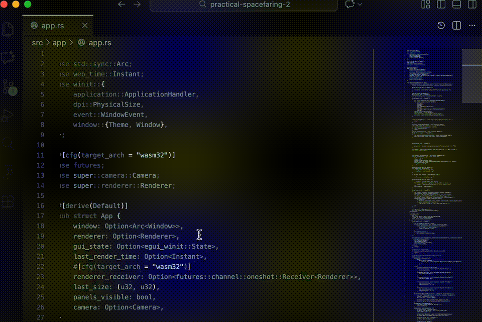

# Rust Python Functional Dark

A dark color theme for VS Code optimized for Rust and Python development.

## Features

- Dark theme optimized for long coding sessions
- Special syntax highlighting for Rust and Python
- Clear distinction between different code elements
- Reduced eye strain through careful color selection
- Functional programming-inspired design philosophy

## Screenview

[](media/rpfd-screenview.gif)

## Design Philosophy

- Core mapping: functions/actions use the cool accent; verbs/operations use the warm accent.
- We bias toward the cyan → yellow band because most people (including those with deuteranomaly) are more sensitive to contrast in this range.
- Visual emphasis is limited to 3 ranks (0–2) to keep contrast reliable and reduce false salience.

### Emphasis Ranks (0 = strongest)

| Rank | Intent | Visual Intensity |
| --- | --- | --- |
| 0 | Primary focus (actions, errors, key edges) | Highest chroma, highest contrast |
| 1 | Secondary focus (types, structure, navigation) | Mid chroma, mid contrast |
| 2 | Tertiary context (hints, punctuation, low-salience UI) | Low chroma, lower contrast |

### Palette Semantics

| Role | Example usage | Color |
| --- | --- | --- |
| Base background | Editor, panels | `#0c0c10` |
| Foreground text | Default text | `#aac3bb` |
| Cool accent (actions) | Functions, active UI | `#8fb6b8` |
| Warm accent (verbs) | Operators, active borders | `#c2b084` |
| Link / interactive | Links, active text | `#9bc2c4` |
| Warning | Warnings / caution | `#c8bfa8` / `#cdbb8f` |
| Error | Errors / failures | `#d0667f` / `#e2768f` |
| Info | Informational | `#87b2d1` |

## Installation

1. Launch VS Code
2. Go to Extensions (Ctrl+Shift+X / Cmd+Shift+X)
3. Search for "Rust Python Functional Dark"
4. Click Install
5. Select the theme from Code > Preferences > Color Theme

## Recommended Font

For the best experience, we recommend using a programming font with ligatures such as:
- Fira Code
- JetBrains Mono
- Cascadia Code

## Feedback

If you have any suggestions or issues, please open an issue on the GitHub repository.

## Credits

- Anne Treisman, for the glass
- Edward Tufte, for the juice
- Prometheus, for the splice

## License

MIT

**Enjoy!**

`this is a code block`

```
this is a different code block
```
